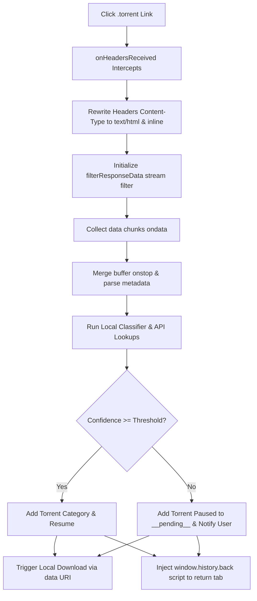
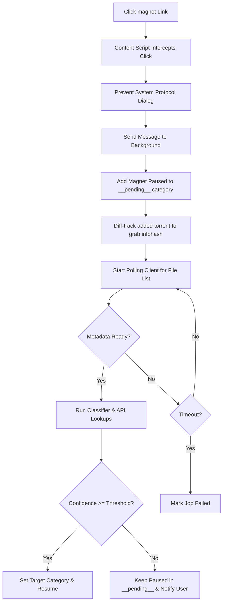

# Smart Torrent Router for Firefox

A production-quality Mozilla Firefox WebExtension (Manifest V2) that automatically intercepts `.torrent` downloads and `magnet:` links, classifies them by content type using a multi-factor scoring engine, routes them to a remote qBittorrent server with the appropriate category, and manages seeding limits according to tracker identity.

---

## 🌟 Key Features

- 📥 **In-Transit Interception**: Uses `browser.webRequest.onHeadersReceived` blocking stream filtering (`browser.webRequest.filterResponseData`) to capture torrent file bytes in-transit. This bypasses the Firefox download manager without triggering secondary network requests, preventing cookie-loss or `403 Forbidden` errors on private trackers.
- ⚡ **Instant File Routing**: Decodes `.torrent` files locally in the background page (via a custom bencode parser) to extract file lists and compute SHA-1 infohashes, classifying and uploading them instantly.
- 🧲 **Magnet Metadata Polling**: Adds magnet links in a paused state to qBittorrent, polling the server's file list once metadata completes to perform high-accuracy classification.
- 🧠 **Classification Scoring Engine**: Fully offline heuristics analyzing file extensions, directory structures, name keywords, and release groups across 9 categories:
  - `movies`, `series`, `anime`, `music`, `games`, `books`, `iso`, `software`, `other`.
- 🌐 **Metadata Providers**: Integrates with TMDB (Movies & Series) and AniList (Anime) APIs as online directories to boost classification confidence when offline details are ambiguous.
- ⏸️ **User Classification Prompt**: If classification confidence is low, the torrent is held paused in a temporary category (`__pending__`) while notifying the user to select the correct category.
- ⚙️ **Router History Log**: A dedicated history panel in the settings dashboard stores previous entries, allows category updates on past items, and supports one-click history clearing.
- 🔌 **Global Enabled Toggle**: Easily turn the extension's interception on or off with a toggle switch inside the popup.
- 💾 **Seeding Limit Enforcement**: A strict anti-leech seeding policy. Magnet links and non-TorrentBD torrents are added with strict seeding limits (`ratioLimit: 0` and `seedingTimeLimit: 0`) to stop seeding immediately, while `torrentbd.net` torrents seed normally (`ratioLimit: -1`).
- 🎨 **Premium Aesthetics**: Features a modern, glassmorphic dark-themed UI dashboard for both the extension popup and options page.

---

## 📂 Directory Layout

```text
smart-torrent-router/
├── public/                 # Static assets copied directly to build
│   ├── icons/              # Extension icons (16x16, 48x48, 128x128)
│   └── manifest.json       # WebExtension Manifest (V2)
├── src/
│   ├── background/         # Background script coordinating events, downloads, and polling
│   ├── content/            # Injected script to capture magnet link clicks and render download shortcuts
│   ├── popup/              # Popover browser action UI (Enabled toggle, server status, recent activity)
│   ├── options/            # Core settings panel and router history dashboard
│   ├── services/
│   │   ├── qbittorrent.ts  # qBittorrent WebAPI connection client
│   │   ├── classifier.ts   # Multi-factor offline classification rules
│   │   ├── metadata.ts     # Metadata lookups orchestrator
│   │   ├── tmdb.ts         # TMDB (Movie/TV) API client
│   │   └── anilist.ts      # AniList (Anime) GraphQL client
│   └── utils/
│       └── bencode.ts      # Custom binary bencode decoder and SHA-1 infohash calculator
├── tests/
│   ├── unit/               # Unit testing (Vitest)
│   └── e2e/                # UI Testing (Playwright)
├── vite.config.ts          # Build aliasing and Vitest configurations
├── build.js                # Custom rollup-based packaging compiler
├── tsconfig.json           # TypeScript configuration
└── package.json            # Scripts, commands, and project dependencies
```

---

## 🚀 Getting Started

### Prerequisites

To compile and pack the extension, you need the following system tools:

- **Node.js** (v18.0.0 or higher)
- **npm** (v9.0.0 or higher)
- **zip** utility (optional, required if you want the build script to pack a `.zip` artifact)
- A running **qBittorrent** client with Web UI enabled.

#### Package Installation Commands:
- **Ubuntu/Debian**:
  ```bash
  sudo apt update
  sudo apt install nodejs npm zip -y
  ```
- **Fedora/RHEL**:
  ```bash
  sudo dnf install nodejs npm zip -y
  ```
- **macOS** (using Homebrew):
  ```bash
  brew install node zip
  ```

### Installation & Build

We provide two ways to compile and prepare the extension.

#### Option A: Automated Build Script (Recommended)
Simply run the custom build utility script in the root directory:
```bash
./build.sh
```
This script will verify your Node/npm environment, run `npm install` automatically if needed, build all scripts, and package them into a distribution-ready `smart-torrent-router.zip` file.

#### Option B: Manual Step-by-Step Commands
1. Install dependencies manually:
   ```bash
   npm install
   ```
2. Compile the WebExtension bundle:
   ```bash
   npm run build
   ```
   *This compiles TypeScript source files and outputs popups, options page, background scripts, and content scripts into the `dist/` directory.*

### Loading in Firefox (Developer Mode)

1. Open Firefox and navigate to `about:debugging`.
2. Click **This Firefox** on the left sidebar.
3. Click **Load Temporary Add-on...**
4. Navigate to your built `dist/` directory and select the `manifest.json` file.
5. The extension is now active! Click the gear icon in the extension popup to open settings and configure your qBittorrent credentials.

---

## ⚙️ Configuration Settings

### qBittorrent Web UI Connection
- **URL**: e.g., `http://localhost:8080` (or your remote seedbox link).
- **Username / Password**: Your Web UI credentials.
- **SSL / HTTPS Exception**: If you connect via HTTPS with a self-signed certificate, Firefox blocks the connection due to CORS/SSL policies. Click the **SSL Help** button on the options page to open qBittorrent in a browser tab and permanently accept the certificate exception.

### Behavior Configuration
- **Confidence Threshold**: Slider from 10% to 100% (default 80%). If classification confidence is below this value, the torrent pauses and prompts you to select a category.
- **Polling Interval**: Seconds between checks for magnet metadata (default 2s).
- **Polling Timeout**: Seconds to wait for metadata before aborting (default 300s).
- **Temporary Category**: Torrents are held in this category while loading metadata (default `__pending__`).

### Category Mappings
Map classification output categories to your custom qBittorrent category labels:
- **movies** (e.g. mapped to `Movies`)
- **series** (e.g. mapped to `TV Series`)
- **anime** (e.g. mapped to `Anime`)
- **music** (e.g. mapped to `Music`)
- **games** (e.g. mapped to `Games`)
- **books** (e.g. mapped to `Books`)
- **iso** (e.g. mapped to `ISOs`)
- **software** (e.g. mapped to `Software`)
- **other** (e.g. mapped to `Downloads`)

### Metadata API integrations
- **TMDB Key**: (v3 Key or v4 Bearer Token) Queries movie and TV show databases.
- **AniList Toggle**: Queries the public GraphQL anime directory to resolve naming indicators (no API key required).

---

## 🛠️ Technical Architecture

### Interception Flows

#### 1. In-Transit Torrent Interception
The extension intercepts requests blocking-ly. If the request is a `.torrent` file:
1. We rewrite the HTTP response headers in `onHeadersReceived` to `Content-Type: text/html` and `Content-Disposition: inline`. This convinces Firefox that it is receiving a normal web page rather than a download file, preventing the Firefox native download manager from hijacking the request.
2. We initialize `browser.webRequest.filterResponseData` to capture the incoming chunks.
3. Once the stream ends, the chunks are merged, parsed, and routed to qBittorrent. We then write a tiny script in the filter to return the tab to the tracker page:
   ```html
   <script>if (window.history.length > 1) { window.history.back(); } else { window.close(); }</script>
   ```
4. Finally, the extension triggers a native download of the file via `browser.downloads.download` using a local `data:` URI to save the file locally.



#### 2. Magnet click Interception


---

## 🧪 Development and Verification

### Development Commands

- **Run Dev Server**:
  ```bash
  npm run dev
  ```
- **Compile Production Build**:
  ```bash
  npm run build
  ```
- **Run Unit Tests (Vitest)**:
  ```bash
  npm run test
  ```
- **Run E2E UI Tests (Playwright)**:
  ```bash
  npm run test:e2e
  ```
- **Reformat Code (Prettier)**:
  ```bash
  npm run format
  ```
- **Lint Code (ESLint)**:
  ```bash
  npm run lint
  ```
